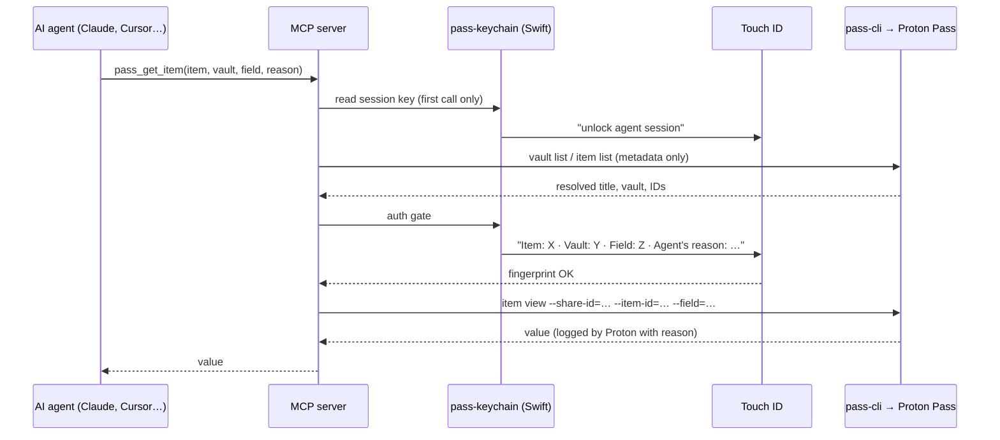

# Proton Pass MCP Server with Touch ID

**Give Claude, Claude Code, Cursor and other AI agents audited access to your Proton Pass secrets, and approve every single secret with Touch ID on macOS.**

[](https://github.com/seliem-attia/proton-pass-touchid-mcp/actions/workflows/ci.yml)
[](LICENSE)


`proton-pass-touchid-mcp` is a [Model Context Protocol](https://modelcontextprotocol.io) (MCP) server that wraps Proton's official [Proton Pass CLI (`pass-cli`)](https://github.com/protonpass/pass-cli). Your AI assistant can list vaults, read passwords and API keys, get TOTP codes, or render `.env` files. **Every secret value needs your fingerprint first.** The Touch ID dialog shows the item and vault that will *really* be read (resolved by the server, not typed by the agent), and the agent's reason.

> Unofficial community project. Not affiliated with or endorsed by Proton AG.

---

## Contents

- [Why this exists](#why-this-exists)
- [Features](#features)
- [How it works](#how-it-works)
- [Requirements](#requirements)
- [Installation](#installation)
- [Connect your MCP client](#connect-your-mcp-client)
- [MCP tools](#mcp-tools)
- [Terminal usage (`passx`)](#terminal-usage-passx)
- [Configuration](#configuration)
- [Security model](#security-model)
- [FAQ](#faq)
- [Troubleshooting](#troubleshooting)
- [Development](#development)
- [License](#license)

## Why this exists

AI coding agents need credentials: API keys for deployments, database URLs, tokens for other MCP servers. The usual options are bad:

- **Plain text in `.env` or MCP config files.** Anything on disk can leak through backups, screenshots, commits or the agent itself.
- **Password manager CLI with a long-lived unlocked session.** Once unlocked, the agent can read *every* secret, and you never see what it takes.
- **Typing your macOS password on every access.** It is safe, but so annoying that you end up switching it off.

This server takes a middle path. Proton Pass stays the single source of truth, the agent gets its own scoped identity, and **every secret needs one Touch ID tap per session**, with a dialog that names the real item and the reason.

## Features

- 🔐 **Touch ID per secret.** Each distinct item/field needs its own named biometric approval. Denied or failed reads are never remembered as approved.
- 🎯 **Spoof-resistant dialog.** The server resolves the target from metadata first and shows the real title and vault. Agent-supplied text is stripped of control, bidi and zero-width characters and capped in length.
- 📄 **Safe `.env` rendering.** `pass_inject` lists *every* referenced secret in the dialog, binds the approval to the exact template content, renders from a private copy, and writes atomically with mode `0600`. Symlinks are refused, and existing files are only replaced on request.
- ⏱️ **TOTP codes, never seeds.** `pass_get_totp` returns only numeric codes. TOTP fields, whole-item reads and `?totp=uri` references are refused everywhere else.
- 🧾 **Mandatory reason + Proton audit log.** Every read carries a `reason`, shown in the dialog and logged server-side by Proton (`pass_audit`).
- 🪪 **Scoped agent identity.** The agent uses its own Proton Pass agent token, limited to the vaults you grant. An optional local vault allowlist adds a second layer.
- 🧠 **Key in RAM only.** The session key is read from the keychain once per process and never written to disk.
- 🧹 **Least-privilege subprocesses.** Minimal child environment, timeouts on every call, `--flag=value` arguments, and one tool call at a time. Error messages never echo `pass-cli` output.
- 🧪 **Tested security properties.** An end-to-end test suite with a fake `pass-cli` and a fake keychain runs in CI.

## How it works



| Component | Purpose |
|---|---|
| [`mcp/index.mjs`](mcp/index.mjs) | MCP server around `pass-cli`: target resolution, Touch ID model, reasons, auto re-login |
| [`helper/pass-keychain.swift`](helper/pass-keychain.swift) | Small Swift helper: stores secrets in the login keychain and enforces Touch ID before every read |
| [`bin/passx`](bin/passx) | Terminal wrapper: `pass-cli` with the keychain key (one Touch ID per command) |
| [`scripts/install.sh`](scripts/install.sh) | Builds the helper, creates the session key, stores the agent token, signs in |
| [`mcp/test/`](mcp/test) | Security test suite (fake `pass-cli` + fake keychain) |

`pass-cli` runs with `PROTON_PASS_KEY_PROVIDER=env`. The session key is the SQLCipher passphrase of the local session database. The key and the agent token live in the login keychain under service `proton-pass-agent`, accounts `encryption-key` and `pat`.

## Requirements

- macOS with Touch ID (the login password or Apple Watch work as fallback unless you set biometrics-only mode)
- [Proton Pass CLI](https://protonpass.github.io/pass-cli/) (`pass-cli`): `brew install protonpass/tap/pass-cli`
- Node.js 18 or newer
- Xcode Command Line Tools (`xcode-select --install`) to compile the Swift helper
- A Proton account on which `pass-cli agent create` works (agent tokens)

## Installation

```bash
git clone https://github.com/seliem-attia/proton-pass-touchid-mcp.git
cd proton-pass-touchid-mcp
./scripts/install.sh
```

The installer asks for an **agent token**. Create it as your normal Proton user account, and grant only the vault(s) the agent really needs:

```bash
pass-cli login
pass-cli agent create "Claude Code" --expiration 6m --vault "AI Secrets"
```

Tip: create a dedicated vault such as "AI Secrets" and move only the credentials your agents need into it.

## Connect your MCP client

### Claude Code

```bash
claude mcp add --scope user proton-pass -- node ~/.config/proton-pass-agent/mcp/index.mjs
```

### Claude Desktop

Add this to `~/Library/Application Support/Claude/claude_desktop_config.json` and restart the app:

```json
{
  "mcpServers": {
    "proton-pass": {
      "command": "node",
      "args": ["/Users/YOUR_USER/.config/proton-pass-agent/mcp/index.mjs"],
      "env": { "PASS_AGENT_NAME": "Claude Code" }
    }
  }
}
```

### Cursor, Windsurf and other MCP clients

Any client that supports stdio MCP servers works. The command is `node`, and the argument is the path to `mcp/index.mjs`.

## MCP tools

| Tool | Touch ID | Returns secret values? | Description |
|---|---|---|---|
| `pass_status` | session unlock | no | Signed-in agent, `pass-cli` version, allowlist |
| `pass_list_vaults` | session unlock | no | Vaults the agent can access |
| `pass_list_items {vault?}` | session unlock | no | Titles, IDs, type, state (whitelisted fields only) |
| `pass_item_fields {reason, vault?, item?, uri?}` | session unlock | no | Field names only; values are discarded |
| `pass_get_item {reason, field, vault?, item?, uri?}` | **one named tap per secret** | yes | Read exactly one field (whole-item reads are not offered) |
| `pass_get_totp {reason, vault?, item?, uri?, field?}` | **one named tap per item** | code only | Current TOTP code(s), never the seed |
| `pass_inject {reason, inFile, outFile?, overwrite?}` | **one tap per render, lists all secrets** | only without `outFile` | Render a `{{ pass://… }}` template (max 10 secrets) into a `0600` file |
| `pass_audit {limit?}` | session unlock | no | Proton's audit log for this agent |

Items can be addressed by title (`item` + optional `vault`) or by reference (`uri: "pass://VAULT/ITEM[/FIELD]"`, names or IDs). Ambiguous titles are refused with a list of candidates.

Example prompt: *"Use proton-pass to render `.env.tpl` into `.env`."* The secrets land in the file and never enter the conversation.

## Terminal usage (`passx`)

```bash
ln -s ~/.config/proton-pass-agent/passx /opt/homebrew/bin/passx

passx vault list
passx item list "AI Secrets" --output json
PROTON_PASS_AGENT_REASON="deploy" passx item view --vault-name "AI Secrets" --item-title "X" --field password
passx inject -i examples/env.example.tpl -o .env
```

`passx run` is blocked by default: `pass-cli run` passes the session key to the child process. Set `PASSX_ALLOW_RUN=1` only for commands you trust completely.

## Configuration

All settings are optional environment variables, set in the MCP client's `env` block:

| Variable | Default | Purpose |
|---|---|---|
| `PASS_AGENT_ALLOWED_VAULTS` | (unset = all granted) | Comma-separated vault names or share IDs the server may touch, on top of the token's scope |
| `PASS_KEYCHAIN_BIOMETRY_ONLY` | (unset) | `1` = fingerprint only, no login-password fallback. Set it for the helper, e.g. in the MCP `env` block |
| `PASS_AGENT_NAME` | (unset) | Agent name for `pass_audit` |
| `PASS_AGENT_HOME` | parent directory of `mcp/` | Install directory |
| `PASS_AGENT_SESSION_DIR` | `$PASS_AGENT_HOME/session` | Encrypted `pass-cli` session |
| `PASS_KEYCHAIN_BIN` | `$PASS_AGENT_HOME/pass-keychain` | Path of the Swift helper |
| `PASS_AGENT_KEYCHAIN_SERVICE` | `proton-pass-agent` | Keychain service name |
| `PASS_CLI_BIN` | `/opt/homebrew/bin/pass-cli`, `/usr/local/bin/pass-cli`, `~/.local/bin/pass-cli`, or `PATH` | Path of `pass-cli` |

### Template syntax

```text
API_KEY={{ pass://AI Secrets/Stripe/api_key }}
DB_URL={{ pass://SHARE_ID/ITEM_ID/connection_string }}
```

- Field names with special characters must be **URL-encoded** (`API Key` → `API%20Key`). `pass_item_fields` shows the exact names, including section fields such as `Prod.token`.
- Up to 10 distinct secrets per template, so the dialog can list all of them. Query strings (`?totp=…`) and TOTP fields are not supported in templates.
- Share and item IDs can differ between the MCP session and your own user session in the terminal. In the terminal, prefer name-based selectors.

## Security model

Read [SECURITY.md](SECURITY.md) for the full threat model. The most important points:

- **Where the guarantee holds.** "One Touch ID per secret" is enforced *inside this MCP server*. An agent that also has a shell or can write files outside the MCP (Claude Code, Cursor agents) could call the keychain helper or `pass-cli` directly. After one session-unlock tap it could then read everything the agent token allows. **Scope the agent token to a dedicated vault**, and treat the session-unlock prompt as "access to that whole vault".
- **Touch ID is enforced by the helper process, not by a keychain ACL.** A local process running as your user can read the key with `security find-generic-password`, which shows only the regular keychain dialog. Hardware binding would need an Apple Developer certificate. Use FileVault and a screen lock.
- **Approved secrets enter the model context.** Anything `pass_get_item` returns is sent to your model provider. Use `pass_inject` with `outFile` for secrets that only need to end up in a file.
- **Proton's audit log** records every item read. The agent cannot suppress it, but the reason stored there is written by the agent.

## FAQ

**Is this an official Proton Pass MCP server?**
No. It is an independent open-source project built on Proton's official `pass-cli`.

**Does the AI see my passwords?**
Only the secrets you approve with Touch ID, and only through `pass_get_item`, `pass_get_totp`, or `pass_inject` without `outFile`. Listing tools and `pass_item_fields` never return values.

**How is this different from other Proton Pass MCP servers?**
The focus is human-in-the-loop approval: a named biometric prompt per secret that shows the real target, a mandatory reason, a scoped agent token, template approvals that list every secret, and no plain-text keys on disk.

**How many Touch ID prompts will I get?**
One to unlock the session, when the MCP server process starts its first call, then one per distinct secret. Reading the same secret again in the same session does not prompt again.

**Does it work on Linux or Windows?**
Not yet. The Touch ID gate relies on macOS LocalAuthentication and the login keychain.

**Can I revoke the agent?**
Yes: `pass-cli agent access revoke "Claude Code" --vault "…"`, or delete the agent in Proton Pass. You can also remove the local entries with `pass-keychain delete proton-pass-agent pat`.

## Troubleshooting

| Symptom | Fix |
|---|---|
| `failed to authenticate: non-existent session` | Normally handled by auto re-login. If it persists, re-run `./scripts/install.sh`. |
| `Ambiguous: N items match` | Several items share the title. Add `vault`, or use the `uri` from the error message. |
| `'outFile' exists; pass overwrite=true` | Intentional. Let the agent retry with `overwrite: true`; the dialog then says the file is replaced. |
| `Invalid reference format` in `pass_inject` | URL-encode field names with special characters. |
| No Touch ID dialog appears | Rebuild the helper: `swiftc -O helper/pass-keychain.swift -o ~/.config/proton-pass-agent/pass-keychain && codesign --force --sign - ~/.config/proton-pass-agent/pass-keychain` |
| New MCP tools not visible | Restart Claude Desktop, or reconnect the server in your client. |

## Development

```bash
cd mcp
npm ci
npm test            # end-to-end security tests, no Proton account needed
```

Issues and pull requests are welcome. Please report security problems privately, as described in [SECURITY.md](SECURITY.md).

## License

[MIT](LICENSE) © Seliem Attia

*Keywords: Proton Pass MCP, Model Context Protocol, Claude Code password manager, Claude Desktop secrets, Touch ID secrets for AI agents, macOS keychain, pass-cli, secure API keys for LLM agents, .env from password manager, TOTP for AI agents.*
