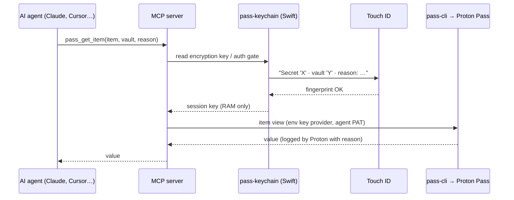

# Proton Pass MCP Server with Touch ID

**Give Claude, Claude Code, Cursor and other AI agents audited access to your Proton Pass secrets, and approve every single secret with Touch ID on macOS.**

[](https://github.com/seliem-attia/proton-pass-touchid-mcp/actions/workflows/ci.yml)
[](LICENSE)


`proton-pass-touchid-mcp` is a [Model Context Protocol](https://modelcontextprotocol.io) (MCP) server that wraps Proton's official [Proton Pass CLI (`pass-cli`)](https://github.com/protonpass/pass-cli). Your AI assistant can list vaults, read passwords, API keys and TOTP codes, or render `.env` files. It cannot read anything you did not approve with your fingerprint. The biometric prompt shows **which** secret is requested, from **which** vault and **why**.

> Unofficial community project. Not affiliated with or endorsed by Proton AG.

---

## Contents

- [Why this exists](#why-this-exists)
- [Features](#features)
- [How it works](#how-it-works)
- [Requirements](#requirements)
- [Installation](#installation)
- [Connect your MCP client](#connect-your-mcp-client)
- [MCP tools](#mcp-tools)
- [Terminal usage (`passx`)](#terminal-usage-passx)
- [Configuration](#configuration)
- [Security model](#security-model)
- [FAQ](#faq)
- [Troubleshooting](#troubleshooting)
- [License](#license)

## Why this exists

AI coding agents need credentials: API keys for deployments, database URLs, tokens for MCP servers. The usual options are bad:

- **Plain text in `.env` or MCP config files.** Anything on disk can leak through backups, screenshots, commits or the agent itself.
- **Password manager CLI with a long-lived unlocked session.** Once unlocked, the agent can read *every* secret, and you never see what it takes.
- **Typing your macOS password on every access.** It is safe, but so annoying that you end up switching it off.

This server takes a middle path. Proton Pass stays the single source of truth, the agent gets its own scoped identity, and **every secret needs one Touch ID tap per session**, with a dialog that names the item and the reason.

## Features

- 🔐 **Touch ID per secret.** Each distinct item or field needs its own named biometric approval (passcode fallback).
- 🧾 **Mandatory reason + Proton audit log.** Every read carries a `reason`. It is shown in the Touch ID dialog and logged server-side by Proton (`pass_audit`).
- 🪪 **Scoped agent identity.** The agent uses its own Proton Pass agent token (PAT), limited to the vaults you grant.
- 🧠 **Key in RAM only.** The session encryption key is read from the keychain once per process and never written to disk.
- 🗝️ **No plain-text secrets on disk.** The `pass-cli` session database is encrypted with a key that lives in the macOS login keychain.
- 📄 **`.env` rendering.** `pass_inject` renders `pass://` templates into files with mode `0600`.
- 🏷️ **Field discovery without values.** `pass_item_fields` returns field names only. Values are discarded inside the server.
- 🔁 **Self-healing session.** Expired `pass-cli` sessions are re-established automatically with the agent token.
- 💻 **Terminal wrapper.** `passx` runs `pass-cli` with the same Touch ID gate, without macOS password prompts.

## How it works



| Component | Purpose |
|---|---|
| [`mcp/index.mjs`](mcp/index.mjs) | MCP server around `pass-cli`: Touch ID model, reasons, auto re-login |
| [`helper/pass-keychain.swift`](helper/pass-keychain.swift) | Small Swift helper: stores secrets in the login keychain and enforces Touch ID before every read |
| [`bin/passx`](bin/passx) | Terminal wrapper: `pass-cli` with the keychain key (one Touch ID per command) |
| [`scripts/install.sh`](scripts/install.sh) | Builds the helper, creates the session key, stores the agent token, signs in |

`pass-cli` runs with `PROTON_PASS_KEY_PROVIDER=env`. The session key is the SQLCipher passphrase of the local session database. The key and the agent token live in the login keychain under service `proton-pass-agent`, accounts `encryption-key` and `pat`.

## Requirements

- macOS with Touch ID (or Apple Watch unlock; the device passcode works as fallback)
- [Proton Pass CLI](https://protonpass.github.io/pass-cli/) (`pass-cli`): `brew install protonpass/tap/pass-cli`
- Node.js 18 or newer
- Xcode Command Line Tools (`xcode-select --install`) to compile the Swift helper
- A Proton account on which `pass-cli agent create` works (agent tokens)

## Installation

```bash
git clone https://github.com/seliem-attia/proton-pass-touchid-mcp.git
cd proton-pass-touchid-mcp
./scripts/install.sh
```

The installer asks for an **agent token**. Create it as your normal Proton user account, and grant only the vault(s) the agent really needs:

```bash
pass-cli login
pass-cli agent create "Claude Code" --expiration 1y --vault "AI Secrets"
```

Tip: create a dedicated vault such as "AI Secrets" and move only the credentials your agents need into it.

## Connect your MCP client

### Claude Code

```bash
claude mcp add --scope user proton-pass -- node ~/.config/proton-pass-agent/mcp/index.mjs
```

### Claude Desktop

Add this to `~/Library/Application Support/Claude/claude_desktop_config.json` and restart the app:

```json
{
  "mcpServers": {
    "proton-pass": {
      "command": "node",
      "args": ["/Users/YOUR_USER/.config/proton-pass-agent/mcp/index.mjs"],
      "env": { "PASS_AGENT_NAME": "Claude Code" }
    }
  }
}
```

### Cursor, Windsurf and other MCP clients

Any client that supports stdio MCP servers works. The command is `node`, and the argument is the path to `mcp/index.mjs`.

## MCP tools

| Tool | Touch ID | Returns secrets? | Description |
|---|---|---|---|
| `pass_status` | session unlock | no | Signed-in agent / session info |
| `pass_list_vaults` | session unlock | no | Vaults the agent can access (JSON) |
| `pass_list_items {vault?}` | session unlock | no | Item titles and IDs |
| `pass_item_fields {reason, vault?, item?, uri?}` | session unlock | no | Field names only; values are discarded |
| `pass_get_item {reason, vault?, item?, uri?, field?}` | **one named tap per secret** | yes | Read one item or field, e.g. `password`, `totp` |
| `pass_inject {reason, inFile, outFile?}` | **one named tap per render** | only without `outFile` | Render a `pass://` template (e.g. `.env.tpl`) into a `0600` file |
| `pass_audit {limit?}` | session unlock | no | Proton's audit log for this agent |

Example prompt: *"Use proton-pass to read the `password` field of item `Supabase service key` in vault `AI Secrets` and write it to `.env`."*

## Terminal usage (`passx`)

```bash
ln -s ~/.config/proton-pass-agent/passx /opt/homebrew/bin/passx

passx vault list
passx item list "AI Secrets" --output json
PROTON_PASS_AGENT_REASON="deploy" passx item view --vault-name "AI Secrets" --item-title "X" --field password
passx inject -i examples/env.example.tpl -o .env
```

## Configuration

All settings are optional environment variables, set in the MCP client's `env` block:

| Variable | Default | Purpose |
|---|---|---|
| `PASS_AGENT_HOME` | parent directory of `mcp/` | Install directory |
| `PASS_AGENT_SESSION_DIR` | `$PASS_AGENT_HOME/session` | Encrypted `pass-cli` session |
| `PASS_KEYCHAIN_BIN` | `$PASS_AGENT_HOME/pass-keychain` | Path of the Swift helper |
| `PASS_AGENT_KEYCHAIN_SERVICE` | `proton-pass-agent` | Keychain service name |
| `PASS_CLI_BIN` | `/opt/homebrew/bin/pass-cli`, `/usr/local/bin/pass-cli`, or `PATH` | Path of `pass-cli` |
| `PASS_AGENT_NAME` | (unset) | Agent name for `pass_audit` |

### Template gotchas

- Field names with spaces or umlauts must be **URL-encoded** in `pass://` references (`API Key` → `API%20Key`). Use `pass_item_fields` to see the exact names.
- Share and item IDs can differ between the MCP session and your own user session in the terminal. In the terminal, prefer name-based selectors (`--vault-name`, `--item-title`).

## Security model

Short version: this is **much better than plain-text secrets or an always-unlocked CLI**, and it is honest about what it cannot do. Read [SECURITY.md](SECURITY.md) for the full threat model. The main limits:

- Touch ID is enforced **by the helper process, not by a keychain ACL.** A local process running as your user can read the key with `security find-generic-password`, which only shows the regular keychain dialog. Hardware binding (Secure Enclave or data-protection keychain) would need an Apple Developer certificate. Protect the Mac with FileVault and a screen lock.
- The **reason text is written by the AI agent.** The dialog marks it as such. Always check the *item name* before you approve.
- A secret you approved goes into the agent's context and is sent to the model provider. Use `pass_inject` with `outFile` to keep secrets out of the conversation.
- Proton's server-side audit log records every item read and cannot be bypassed by the agent.

## FAQ

**Is this an official Proton Pass MCP server?**
No. It is an independent open-source project built on Proton's official `pass-cli`.

**Does the AI see my passwords?**
Only the secrets you approve with Touch ID, and only when it calls `pass_get_item` (or `pass_inject` without `outFile`). Listing tools and `pass_item_fields` never return values.

**How is this different from other Proton Pass MCP servers?**
The focus is human-in-the-loop approval: a named biometric prompt per secret, a mandatory reason, a scoped agent token, and no plain-text keys on disk.

**Does it work on Linux or Windows?**
Not yet. The Touch ID gate relies on macOS LocalAuthentication and the login keychain.

**How many Touch ID prompts will I get?**
One per distinct secret per session, where a session is the lifetime of the MCP server process. Reading the same secret again does not prompt again.

**Can I revoke the agent?**
Yes: `pass-cli agent access revoke "Claude Code" --vault "…"`, or delete the agent in Proton Pass. You can also remove the keychain entries with `pass-keychain delete proton-pass-agent pat`.

## Troubleshooting

| Symptom | Fix |
|---|---|
| `failed to authenticate: non-existent session` | Normally handled by auto re-login. If it persists, re-run `./scripts/install.sh`. |
| `Invalid reference format` in `pass_inject` | URL-encode field names with spaces or special characters. |
| `Share with id … not found` in the terminal | IDs differ between sessions. Use `--vault-name` / `--item-title`. |
| No Touch ID dialog appears | Rebuild the helper: `swiftc -O helper/pass-keychain.swift -o ~/.config/proton-pass-agent/pass-keychain && codesign --force --sign - ~/.config/proton-pass-agent/pass-keychain` |
| New MCP tools not visible | Restart Claude Desktop, or reconnect the server in your client. |

## Contributing

Issues and pull requests are welcome. Please report security problems privately, as described in [SECURITY.md](SECURITY.md).

## License

[MIT](LICENSE) © Seliem Attia

*Keywords: Proton Pass MCP, Model Context Protocol, Claude Code password manager, Claude Desktop secrets, Touch ID secrets for AI agents, macOS keychain, pass-cli, secure API keys for LLM agents, .env from password manager.*
